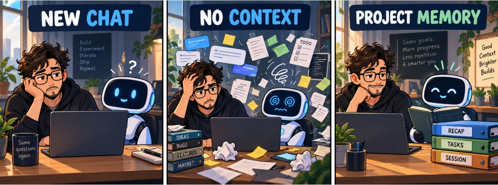
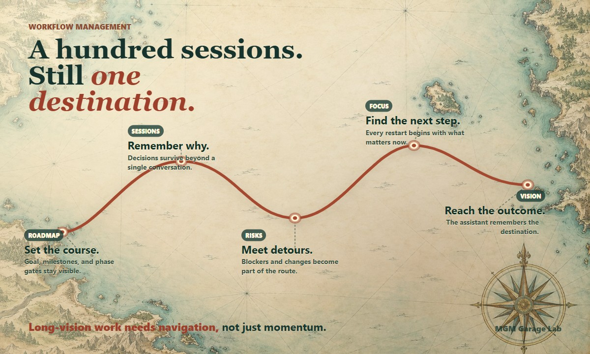

# Workflow Management for Kiro

A skill for [Kiro](https://kiro.dev) that keeps your work organized across AI
sessions, so nothing depends on what a single chat remembers. It stores your
work state (sessions, tasks, a short RECAP, notes, decisions) as plain text files
in a folder you own.

It is the Kiro edition of
[workflow-management-skill](https://github.com/mmorgano/workflow-management-skill)
and adds an **optional team mode**: a small shared context for a roadmap, tasks,
and assignments, next to your own personal context.

[MGM Garage Lab](https://mgmgaragelab.com/) ·
[Project website](https://mgmgaragelab.com/workflow-management-skill/) ·
[Core skill (Claude Code, Codex)](https://github.com/mmorgano/workflow-management-skill)

An open-source project by [MGM Garage Lab](https://mgmgaragelab.com/).

> [!WARNING]
> **Public beta: this needs your help to become reliable.**
>
> - The **personal skill** (`workflow-management`) was tried by its author in a
>   local Kiro session with the DeepSeek model. Expect rough edges, and please
>   report them.
> - The **team mode** (`team-workflow-management`) is **experimental and has never
>   been tested**. Do not use it on real team work yet. Try it on a scratch folder
>   and a scratch Git repository, and tell us what breaks.
> - Most of the [checklist](#try-it-checklist-for-the-first-run) below is still
>   untested. Behavior, file names, and instructions may change between versions.
>
> Report problems and surprises in the
> [issues](https://github.com/mmorgano/workflow-management-kiro/issues). The skill
> format follows the documented Kiro format; a known Kiro write bug on Windows is
> described under [Known issue](#known-issue-write-errors-on-windows).

<p align="center">
  
</p>

## What you get

- **`workflow-management`** — the personal skill: start and close working
  sessions, keep tasks and a short RECAP, plan sprints, record decisions. It
  introduces itself the first time and guides you through setup in plain words.
- **`team-workflow-management`** (experimental) — the optional team layer: a shared context in a
  dedicated Git repository holding the roadmap, unassigned tasks, and
  assignments. Personal notes never go there.
- **`contacts-workflow-management`** (new, untested) — an optional private address
  book (`CONTACTS.md`, in your personal context only) with five standard fields
  (name, username, role, email, notes) that you can extend with your own columns.
  It reads your layout, merges data without deleting anything, never guesses a
  username, and drafts mails or ticket comments from your templates. Your
  preferences live in a separate `CONTACTS.config.json`, so updating the skill
  never loses them. It only drafts text; it never sends anything.

Solo users install only `workflow-management`.

## Long-vision projects need navigation

The Kiro edition is designed for long-running projects where the assistant needs
more than a task list. It keeps the route visible across sessions: roadmap,
decisions, current focus, risks, assignments, and the next useful step.

<p align="center">
  
</p>

## Install

Copy the skill folders you want into a Kiro skills folder:

```text
.kiro/skills/workflow-management/            # personal skill (required)
.kiro/skills/team-workflow-management/       # team layer (optional)
.kiro/skills/contacts-workflow-management/   # contacts layer (optional, Kiro only)
```

Use the workspace `.kiro/skills/` of your project (shared with the team when
committed), or your global `~/.kiro/skills/` (personal, all projects). If a skill
has the same name in both places, the workspace one wins. Kiro loads only the name
and description of each skill at first and reads the rest when your request
matches, so the skill stays out of the way for ordinary coding. You can also start
a skill by name with a slash command.

If you use a **custom agent**, note that custom agents do not load skills by
default: add the skills to the agent's `resources` with `skill://` entries (see the
[Kiro documentation](https://kiro.dev/docs/skills/)).

Optional: if the assistant tends to ignore the skill, also add the
[steering file](#optional-steering-file).

Then open a new Kiro chat. The most reliable way to start is to type
`/workflow-management` and pick the skill from the list, then say:

```text
Initialize workflow management for this workspace.
```

Skills are chosen by the model from their descriptions, so results depend on the
model. In the author's first tests a Claude model offered the skill right away,
while DeepSeek often skipped it, treated "session" as Kiro's own session, and
created project folders nobody asked for. If the assistant does not pick the skill
up, start it with the slash command.

The assistant introduces itself, asks which language to use, and creates your
personal context. If the team skill is installed, it also asks whether you want a
shared team context.

## Optional steering file

`.kiro/steering/workflow-management.md` is a short [Kiro steering
file](https://kiro.dev/docs/steering/) with `inclusion: always`: Kiro adds it to
every chat in the workspace where it is installed. It repeats five rules:

1. asking to start, continue, or close a "session" means using the
   `workflow-management` skill, not Kiro's own chat session;
2. if more than one person works on the project, use `team-workflow-management`
   too, after the personal context exists;
3. read the skill's `references/` files from the skill's own folder, never by
   searching the workspace;
4. create workflow records only: no project folders, virtual environments, or Git
   repositories unless asked;
5. ask before writing, one question at a time.

**Why it exists.** Kiro picks a skill from its description, and how well that
works depends on the model. In the author's first tests a Claude model activated
the skill on its own; DeepSeek skipped it, read "session" as Kiro's own session,
and created folders nobody asked for. The steering file is a second reminder for
models that need one.

**Why it is optional.**

- The skill works without it, and models that follow instructions do not need it.
- It is loaded into **every** chat, so it adds a little text to each request,
  including ordinary coding chats that have nothing to do with workflow.
- Installed in `~/.kiro/steering/` it applies to all your workspaces. Prefer the
  workspace `.kiro/steering/` unless you want it everywhere.
- It has **not been tested yet**: it follows the documented steering format, but
  nobody has checked how much it helps. Your feedback on this is especially
  welcome.

To use it, copy the file into `.kiro/steering/` of your workspace. To stop using
it, delete that file.

## Known issue: write errors on Windows

On Windows, Kiro's `fs_write` tool can report an `ENOENT` error whenever it
writes to an absolute path, even though the file is written correctly (Kiro
issue [#11636](https://github.com/kirodotdev/Kiro/issues/11636)). To keep the
first setup smooth, the skill includes `init-session.ps1`: when the error
appears, the assistant runs it through PowerShell to create the folders,
`.workflow-config.json` and the first records in one step, and tells you it did
so. You can also run it yourself:

```powershell
./.kiro/skills/workflow-management/init-session.ps1 -ContextRoot <folder> -WorkspacePath <workspace> -Here
```

It refuses to overwrite an existing configuration unless you pass `-Force`.

## How the team mode works (experimental)

- Everyone keeps a **personal** context (`ai_context_<name>`): sessions, notes,
  focus, private tasks. It is never shared.
- The team shares **one** context (`ai_context_TEAM_<prj_name>`), a dedicated Git
  repository cloned locally and added as a workspace folder.
- Shared tasks are one file each, named by date and description, with an
  `assigned_to` field. Tasks that end are never deleted: they move to `done/` or
  to `discarded/` with a reason (duplicate, solved elsewhere, not useful, not
  reproducible).
- There can be several coordinators. In a small team everyone is one.
- Before assigning a task the assistant fetches from Git, and an assignment counts
  once it is pushed.

Details are in `.kiro/skills/team-workflow-management/`.

## Requirements

- Kiro with access to a workspace folder where the assistant may create files.
- Team mode only: Git, and a **private** repository for the team context (it holds
  names and email addresses). The assistant explains Git steps in plain words.
- Optional: the setup and compaction scripts need Bash (Python 3, `zip`, `unzip`
  for compaction). The guided setup needs none of them, which suits locked-down
  machines. `init-session.ps1` needs only PowerShell.

## Try it (checklist for the first run)

Use a scratch folder, not real work.

1. **Is the skill loaded?** Open a new Kiro session and ask which skills are
   available. Both folder names should appear.
2. **Does it activate on the right thing?** Ask for a trivial code change: the
   skill must *not* start a workflow. Then say "start a work session".
3. **First run in an empty folder:** the introduction is offered and can be
   skipped, the language is asked once, the context is created.
4. **No workspace open:** start Kiro with no folder open (or on a bare folder
   opened as a plain directory) and say "start a work session". It must say in
   one sentence that no workspace is open and offer to open a workspace folder
   first (recommended) or to use an explicit path, reading and creating nothing
   until you answer. With a path, the context is created with `-Here` and no
   `context-path.json` is written.
5. **Without the team skill installed,** everything behaves as in the personal
   edition.
6. **Team mode, with a scratch team repository:** create a team context, then check
   these cases: personal + team folder open (the personal one is used, no
   question); only the team folder open (offers to create a personal context and
   records nothing in the team one); two personal folders (asks which).
7. **Privacy:** ask it to save a personal note in the team context. It must refuse.
   `git status` in the team folder must never list `sessions/` or `focus/`.
8. **Two people (or two clones):** assign the same task from both. Only the first
   push wins; the second person is told it is taken.
9. **Git problems:** with no Git, no network, or a wrong login, the assistant says
   what to do by hand and does not guess credentials.
10. **Confirmations:** check that Kiro really asks before a push.
11. Run `tests/check.sh` on your platform (Linux, macOS, Git Bash on Windows).

Please write down what surprised you: which words were confusing, where you
got lost, what you expected instead, and open an issue with it.

## Keeping it in step with the core

The files under `.kiro/skills/workflow-management/` (except `SKILL.md` and
`init-session.ps1`, which exist only in this package) are copies of the core
repository. `CORE_VERSION` records the core commit they come from.

```bash
./sync-from-core.sh            # copy from ../workflow-management-skill
./sync-from-core.sh --check    # report drift
./tests/check.sh               # sync check, frontmatter, and reference scan
```

## Privacy

Your personal contexts must stay private. Never put a personal context in a
shared or public repository. The team context is the only one meant to be shared,
and it holds no personal records. `CONTACTS.md` holds names and emails: it lives
only in the personal context, together with `CONTACTS.config.json`, and is never
written to the team context.

The contacts skill exists only in this package: it is not part of the core, so
`sync-from-core.sh` does not copy or check it.

## License

Apache License 2.0. See [LICENSE](LICENSE).
